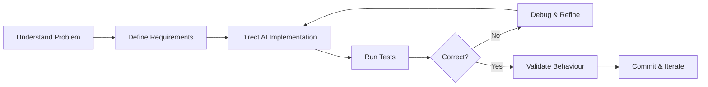

<div align="center">

# ⚡ Ayush Sharma

### Executive - AI @ Garden's Need | Generative AI • Python • Data Analysis

[](https://git.io/typing-svg)

[](https://github.com/ayuxhdev)
[](https://www.linkedin.com/in/ayush-sharma-703626276)

</div>


## 👨‍💻 About Me

- 💼 **Current Role:** Executive - AI, Garden's Need Pvt. Ltd.
- 🔭 **Currently Working On:** Internal Django training management system for Garden's Need, Movie Data Analysis project, Sonic voice assistant upgrades
- 🌱 **Learning:** Deeper backend development, ML fundamentals
- 💬 **Ask Me About:** Prompt engineering, AI-assisted development, data analysis with Python
- 📍 **Based in:** Delhi, India
- 🎓 **Education:** MCA, Indira Gandhi National Open University (2023–2025)

```text
> whoami
Data & Generative AI Analyst

> core_stack
Python | SQL | Pandas | Django | MySQL | Generative AI
```

---

## 🚀 Featured Projects

### 🏢 Training Module Application

Internal employee training, assessment & certification system for Garden's Need — Django, MySQL, AI-assisted development.

- Role-based access control, training lifecycle, assessments, audit logging
- 250+ automated tests passing
- Directed AI-assisted development, validated through rigorous testing

[View Project →](https://github.com/ayuxhdev/Training-Module-Application)

### 🎙️ Sonic - Voice-Controlled Virtual Assistant

Modular Python voice assistant with wake-word activation and Gemini API integration.

- Real-time news retrieval via NewsAPI & dynamic YouTube music search/playback
- Continuous speech recognition & text-to-speech responses

[View Project →](https://github.com/ayuxhdev/Voice-Controlled-Virtual-Assistant)

### 📊 Movie Data Analysis

End-to-end EDA on 9,827 Netflix movies — Python, Pandas, Matplotlib, Seaborn.

- Data cleaning, preprocessing & multi-genre transformation using `explode()`
- Answered 11 business-oriented analytical questions

[View Project →](https://github.com/ayuxhdev/Netflix_Data_Analysis)

---

## 🛠️ Tech Stack

<div align="center">


</div>

**AI Tools:** ChatGPT · Gemini · Claude · Prompt Engineering · LLMs  
**Data & ML:** Pandas · NumPy · Matplotlib · Seaborn · scikit-learn

---

## ⚙️ How I Approach AI-Assisted Development



My focus isn't *"AI wrote the code."* It's: can I define the right system, guide the implementation, detect problems, validate the result, and improve it?

---

## 🔗 Connect

<div align="center">

[](https://www.linkedin.com/in/ayush-sharma-703626276)

</div>


