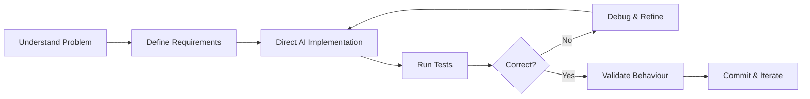

<div align="center">


<h3>👋 Hi, I'm Ayush Sharma</h3>

<a href="https://git.io/typing-svg">
  
</a>

<br>


<a href="https://www.linkedin.com/in/ayush-sharma-703626276">
  
</a>

<a href="https://github.com/ayuxhdev?tab=repositories">
  
</a>

</div>

---

## 👨‍💻 About Me

I'm a **Data & Generative AI Analyst** working at the intersection of **data, AI, automation, and AI-assisted application development**.

Currently working as **Executive - AI at Garden's Need Pvt. Ltd.**, where I use Generative AI, data, and structured AI-assisted workflows to solve practical business problems.

- 📍 **Location:** Delhi, India
- 🎓 **Education:** MCA, Indira Gandhi National Open University (2023–2025)
- 💼 **Current Role:** Executive - AI, Garden's Need Pvt. Ltd.

My work spans:

- 📊 **Data Analysis** using Python, SQL, Pandas, NumPy, Excel, and visualization tools
- 🧠 **Generative AI** using LLMs, Prompt Engineering, and AI-assisted workflows
- ⚙️ **AI-Assisted Development** using AI coding tools to turn requirements into working applications
- 🧪 **Testing & Validation** to verify AI-generated implementations rather than treating generated code as finished code

```text
> whoami
Data & Generative AI Analyst

> core_stack
Python | SQL | Pandas | Django | MySQL | Generative AI
```

---

## 🚀 Featured Projects

### 🏢 Training Module Application

> **Internal employee training, assessment, certification, and workforce development platform for Garden's Need**

[](https://github.com/ayuxhdev/Training-Module-Application)

**Python • Django • MySQL • HTML • CSS • JavaScript • GitHub Actions • AI-Assisted Development**

A full-scale internal application designed to manage structured employee learning across departments and job roles.

- 🔐 Role-based authentication and backend authorization
- 👥 Employee, department, and organizational hierarchy management
- 📚 Training lifecycle and version management
- 🎥 Video lesson progress and watch-session tracking
- 📝 Assessments, scoring, and completion logic
- 🎓 Certification workflows
- 🧾 Audit logging and historical record preservation
- 🧪 **250+ automated tests passing**

---

### 🎙️ Sonic - Voice-Controlled Virtual Assistant

[](https://github.com/ayuxhdev/Voice-Controlled-Virtual-Assistant)

**Python • Gemini API • SpeechRecognition • gTTS • pyttsx3 • NewsAPI • yt-dlp • VLC**

A modular Python-based AI voice assistant with wake-word activation and continuous voice interaction.

- 🎤 Wake-word activation and continuous command recognition
- 🧠 Gemini API integration for natural language responses
- 📰 Real-time news retrieval using NewsAPI
- 🎵 Dynamic YouTube music search and playback
- 🧩 Modular architecture for speech, AI, commands, and media operations

---

### 📊 Netflix Data Analysis

[](https://github.com/ayuxhdev/Netflix_Data_Analysis)

**Python • Pandas • Matplotlib • Seaborn • Exploratory Data Analysis**

End-to-end exploratory analysis of **9,827 Netflix movies**, converting raw movie data into business-oriented insights.

- 🧹 Data cleaning, preprocessing & outlier analysis
- 🎭 Multi-genre normalization using `explode()`
- 📈 Popularity, rating, language & genre comparisons
- 💡 **11 business-oriented analytical questions** answered
- 📊 Data visualization with Matplotlib and Seaborn

```text
Raw Data → Cleaning → Transformation → EDA → Visualization → Business Insights
```

---

## 🛠️ Tech Stack

<div align="center">

### Programming & Development


<br><br>

### Data & Machine Learning


<br><br>

### Generative AI & AI-Assisted Workflows


</div>

---

## ⚙️ How I Approach AI-Assisted Development

I use AI as a **development multiplier**, while keeping problem definition, requirements, validation, and decision-making human-controlled.



My focus isn't *"AI wrote the code."* It's: can I define the right system, guide the implementation, detect problems, validate the result, and improve it?

---

## 🔬 Current Focus

```yaml
current_role:
  title: Executive - AI
  company: Garden's Need Pvt. Ltd.

currently_building:
  - Garden's Need Training Module Application
  - Sonic Voice Assistant Upgrades

currently_exploring:
  - Backend Engineering
  - Applied Machine Learning
  - Production AI Workflows
```

---

## 📈 GitHub Analytics

<div align="center">


</div>

---

## 🎯 What I'm Looking For

I'm interested in opportunities where **data, AI, and practical problem-solving intersect** — environments where AI is used to build useful systems, automate real workflows, analyze data, and improve business decisions.

---

## 🤝 Connect With Me

<div align="center">

<a href="https://www.linkedin.com/in/ayush-sharma-703626276">
  
</a>

<a href="https://github.com/ayuxhdev">
  
</a>

<br><br>

### `Data + AI + Validation = Useful Systems`

</div>


